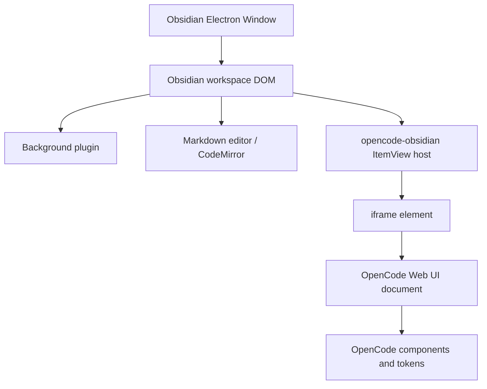
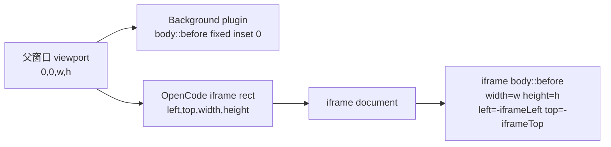
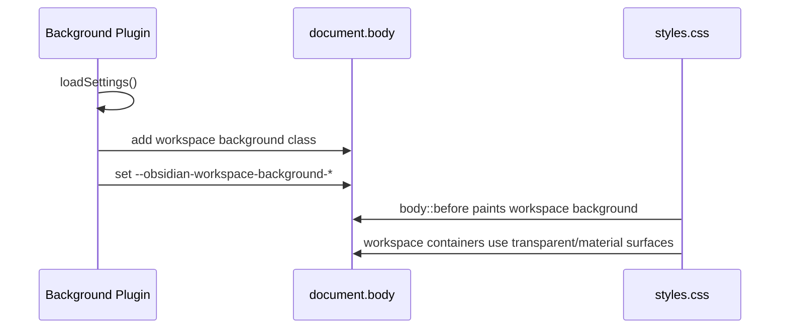
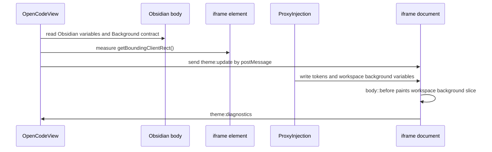
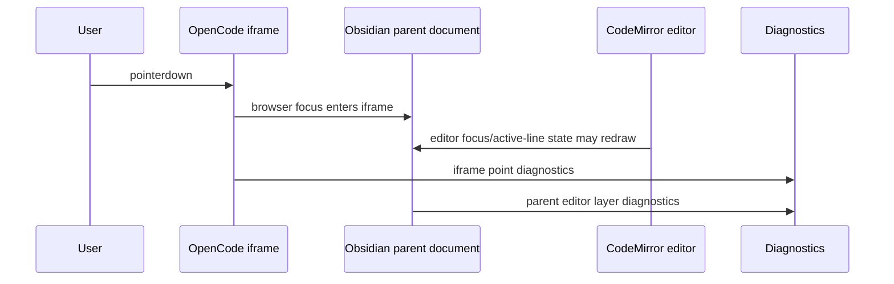

# Obsidian Background 与 OpenCode 外观统一计划

## 这份文档要解决什么

这份文档重新整理 Obsidian、Background 插件、opencode-obsidian、OpenCode Web UI 之间的背景关系。它不沿用之前的文档，也不依赖之前排查过程里的临时结论。目标是给后续实现一个可审查的计划。

用户的真实需求有三组：

1. `webViewAppearance = "opencode"` 时，OpenCode Web UI 保持 OpenCode 自己的视觉风格。
2. `webViewAppearance = "obsidian"` 且 Background 插件未开启时，OpenCode Web UI 使用 Obsidian 的稳定颜色、字体、边框、accent、半透明局部 surface。
3. `webViewAppearance = "obsidian"` 且 Background 插件开启时，OpenCode pane 不能破坏整张背景图的意义。右侧 OpenCode 可以遮住一部分图，也可以有半透明局部 surface，但它不应该变成一块和主编辑区割裂的独立黑板，也不应该在拖动宽度、点击焦点、切 tab 后出现局部黑条、残影或亮度乱跳。

这份文档要做三件事：

1. 解释必要的 Web 概念：MDN、iframe、CSS 变量、`postMessage`、点位诊断。
2. 解释当前现象的技术原因：为什么点 OpenCode 会影响左侧 Markdown editor 的亮度，为什么局部黑条会出现在左侧主编辑区，为什么过去的方案会反复失败。
3. 给出一个跨两个自维护插件的实现计划：Background 插件拥有 workspace 级背景，opencode-obsidian 读取这个背景合同，在 iframe 内画同一个 workspace 背景平面的对应切片。

> [!important]
> 这份文档的计划边界是两个插件都由我们自己维护：`/Users/oujinsai/Projects/opencode-obsidian` 和 `/Users/oujinsai/Projects/obsidian-editor-background`。这个前提改变了解法。OpenCode 插件不再需要在自己的边界里补偿 Background 插件或 CodeMirror 的局部视觉层，Background 插件也可以正式承担 workspace 背景 owner 的职责。

## 术语和资料来源

### MDN 是什么

MDN Web Docs 是 Mozilla 维护的 Web 平台文档站。它给前端开发者解释 HTML、CSS、JavaScript、DOM API、浏览器行为等概念。它不是浏览器标准本身，正式标准通常在 WHATWG、W3C、CSSWG 等组织维护。工程排查时，MDN 很适合拿来统一术语和浏览器 API 的实际使用方式。

参考：

- [MDN Web Docs About MDN](https://developer.mozilla.org/en-US/about)
- [MDN iframe element](https://developer.mozilla.org/en-US/docs/Web/HTML/Reference/Elements/iframe)
- [MDN Window.postMessage](https://developer.mozilla.org/en-US/docs/Web/API/Window/postMessage)
- [MDN CSS custom properties](https://developer.mozilla.org/en-US/docs/Web/CSS/Guides/Cascading_variables/Using_custom_properties)
- [MDN Document.elementsFromPoint](https://developer.mozilla.org/en-US/docs/Web/API/Document/elementsFromPoint)

### iframe 是什么

`iframe` 是 HTML 里的一个元素，用来把另一个 HTML 页面嵌入当前页面。MDN 把它描述成一个嵌套的 browsing context。工程上可以把它理解为“父页面里嵌了一个子页面窗口”。

这件事有几个后果：

1. iframe 内部有自己的 `document`、`html`、`body`、CSS 规则和 JavaScript 运行环境。
2. 父页面里的普通 CSS 选择器不能直接选中 iframe 内部的 DOM。
3. iframe 内部的 CSS 也不能直接读取父页面 DOM 的布局和样式。
4. iframe 和父页面可以通过 `window.postMessage` 传消息。
5. iframe 最终会被浏览器或 Electron 合成到父窗口里；透明背景、focus、重绘时机可能受到合成器影响。

这个项目里，Obsidian 是父页面。OpenCode Web UI 是 iframe 里加载的页面。opencode-obsidian 是把 OpenCode Web UI 放进 Obsidian 的插件。

### CSS 变量是什么

CSS 变量正式名称是 CSS custom properties。它长得像这样：

```css
body {
  --background-primary: #1e1e1e;
}

.panel {
  background: var(--background-primary);
}
```

它的价值是让一个系统把主题值暴露出来，另一个系统按名字消费这些值。Obsidian 官方文档列出了大量主题变量，例如 `--background-primary`、`--background-secondary`、`--text-normal`、`--interactive-accent`。opencode-obsidian 的 Obsidian 外观模式应该优先读取这些稳定变量。

参考：

- [Obsidian CSS variables](https://docs.obsidian.md/Reference/CSS+variables/CSS+variables)
- [MDN Using CSS custom properties](https://developer.mozilla.org/en-US/docs/Web/CSS/Guides/Cascading_variables/Using_custom_properties)

### postMessage 是什么

`window.postMessage` 是浏览器提供的跨窗口通信 API。父页面和 iframe 不能直接把彼此当普通对象访问时，可以用 `postMessage` 发送结构化消息。

这个项目已经在用 `postMessage`：

1. iframe 加载后，proxy 注入脚本发出 `proxy:loaded`。
2. 父窗口收到后，可以把当前 Obsidian 主题变量发给 iframe。
3. iframe 收到 `theme:update` 后，把变量写到自己的 `document.documentElement.style` 上。
4. iframe 也会把 `theme:diagnostics` 发回父窗口，进入 runtime diagnostics。

参考：

- [MDN Window.postMessage](https://developer.mozilla.org/en-US/docs/Web/API/Window/postMessage)

### elementsFromPoint 是什么

`document.elementsFromPoint(x, y)` 会返回屏幕某个点下面按绘制顺序叠起来的元素。它适合回答这样的问题：

1. 鼠标点到的视觉区域里有哪些 DOM 元素。
2. 哪个元素实际拥有可见背景。
3. 某条黑线或色块更可能来自父页面，还是来自 iframe 内部。

这个项目现在已经在两个地方用了类似思路：

1. opencode-obsidian 的 iframe 内部 point diagnostics。
2. Background 插件的 `copy-background-point-diagnostics` 命令。

参考：

- [MDN Document.elementsFromPoint](https://developer.mozilla.org/en-US/docs/Web/API/Document/elementsFromPoint)

## 当前系统有哪几层

这个问题难处理，是因为屏幕上看起来只有左右两个区域，真实系统里有多个渲染世界。



每层职责如下。

| 层 | 真实位置 | 应该负责什么 |
| --- | --- | --- |
| Obsidian workspace | 父窗口 DOM | panes、sidebars、tabs、ribbon、workspace layout |
| Background 插件 | 父窗口 DOM/CSS | 背景图、背景透明模式、编辑区局部视觉层策略 |
| CodeMirror editor | 父窗口 Markdown editor | active line、selection、cursor、table row、code block 等编辑器状态 |
| opencode-obsidian host | 父窗口 Obsidian ItemView | iframe 容器、主题采集、消息桥接、诊断 |
| OpenCode Web UI iframe | iframe 内部 document | OpenCode 页面、composer、session、dialog、局部 surface |
| OpenCode tokens | iframe 内部 CSS | OpenCode 自己的颜色和组件 token |

从这张表可以直接推出一个边界：

OpenCode Web UI 不应该在父窗口里直接修改 `.cm-active`、`.markdown-reading-view`、`.cm-editor`。这些 selector 属于 Obsidian editor 和 Background 插件的世界。opencode-obsidian 可以诊断它们，但不应该靠 patch 它们来隐藏问题。

## 用户看到的现象

用户反复观察到这些现象：

1. 左侧 Markdown editor 出现横向黑条。
2. 左右边界出现竖向色带或拖动后的黑框。
3. 点击 OpenCode Web UI 不同位置后，左侧主编辑区的透亮程度会变化。
4. 切 tab、冷启动、拖动 OpenCode 宽度后，伪影表现会变化。
5. 使用类似 Obsidian 侧边栏的半透明 material 时，视觉更接近用户想要的效果，但局部问题仍然存在。
6. Background 插件改成 workspace 级背景原型后，整体更好看，但局部黑条仍可能出现。

这些现象里有两类问题：

1. 背景图连续性问题：左右两个区域怎样共享同一张背景图。
2. 编辑器局部状态层问题：active line、selection、表格行、resize handle、workspace chrome 怎样盖在背景图上。

过去的修复反复失败，主要是因为这两类问题被混在一个实现里处理了。

## 当前证据

### iframe 内部点位诊断

用户在 OpenCode Web UI 里点击后，iframe 内部诊断记录到点击目标类似这样：

```json
{
  "themeReason": "iframe-pointerdown-settled-600",
  "point": {
    "type": "pointerdown",
    "x": 188,
    "y": 328,
    "screenX": 1181,
    "screenY": 430,
    "pointerType": "mouse"
  },
  "target": {
    "tag": "div",
    "id": "message-msg_ec6b31c82001EvfPMgfEu3D4iG",
    "className": "min-w-0 w-full max-w-full pt-6",
    "backgroundColor": "rgba(0, 0, 0, 0)"
  },
  "pseudoBackgrounds": []
}
```

这段证据说明：

1. OpenCode 内部点击目标是普通 message 区域。
2. 目标背景是透明。
3. iframe 内部点位没有抓到负责左侧横向黑条的伪元素背景。
4. OpenCode 内部可以有局部 surface、shadow、dialog、composer，但这次左侧黑横条没有来自 iframe 内部。

### 父窗口诊断

父窗口 runtime diagnostics 抓到类似这样的层：

```json
{
  "workspaceFocus": {
    "documentHasFocus": false,
    "activeLeafViewType": "markdown",
    "openCodeLeafIsActive": false,
    "iframeIsDocumentActiveElement": true,
    "focusedIframeWithoutActiveOpenCodeLeaf": true
  },
  "largeDarkEditorLayers": [
    {
      "className": "cm-line cm-active",
      "backgroundColor": "rgb(40, 40, 40)",
      "left": 291,
      "top": 248,
      "width": 432,
      "height": 21,
      "area": 9075
    }
  ]
}
```

这段证据说明：

1. 浏览器焦点已经进入 iframe。
2. Obsidian active leaf 仍可能是 Markdown leaf。
3. 父窗口里存在 `.cm-line.cm-active`，背景色是 `rgb(40, 40, 40)`。
4. 这个矩形大小和用户截图里的横向黑条一致。

这个状态解释了“点 OpenCode 为什么会影响主界面亮度”：点击 iframe 会改变浏览器焦点。Obsidian、CodeMirror、主题和 Background 插件会根据 focus、active leaf、selection、hover、active line 等状态重绘父窗口里的 editor 层。OpenCode 点击没有把黑条画到左边，但它改变了全局焦点状态，父窗口 editor 的局部状态层随之变化。

### Background 插件当前原型

本机 fork `/Users/oujinsai/Projects/obsidian-editor-background` 里已经有 workspace 背景原型。

`src/Plugin.ts` 当前会把这些变量写到 `doc.body`：

```ts
doc.body.style.setProperty("--obsidian-editor-background-image", `url('${this.settings.imageUrl}')`);
doc.body.style.setProperty("--obsidian-editor-background-opacity", `${this.settings.opacity}`);
doc.body.style.setProperty("--obsidian-editor-background-bluriness", `blur(${this.settings.bluriness})`);
doc.body.style.setProperty("--obsidian-editor-background-position", this.settings.position);
```

`styles.css` 当前有 workspace 级背景层：

```css
body.obsidian-editor-background-workspace-prototype:before {
  content: "";
  background-blend-mode: overlay;
  background-repeat: no-repeat;
  background-position: var(--obsidian-editor-background-position);
  background-size: cover;
  position: fixed;
  inset: 0;
  pointer-events: none;
  background-image: var(--obsidian-editor-background-image);
  opacity: var(--obsidian-editor-background-opacity);
  filter: var(--obsidian-editor-background-bluriness);
  z-index: 0;
}
```

这说明 Background 插件已经开始从“每个 editor 自己画背景”转向“整个 workspace 有一张背景画布”。用户肉眼也反馈这个方向更好看。

## 根因模型

当前问题可以拆成三条因果链。

### 第一条：iframe 是独立 document

iframe 里的页面不能直接露出父窗口背景。透明 iframe 在 Electron 里还可能遇到合成器黑底、残影、focus 重绘残留。想让 OpenCode pane 看起来延续 Obsidian 背景图，稳定做法是在 iframe 内部重画同一张背景图。

重画有两种方式：

1. 让 iframe 以自己的宽高 `background-size: cover` 画图。
2. 让 iframe 画父 workspace 背景平面的一个切片。

第一种会让每个 pane 以自己的宽高重新裁切图片。拖动宽度时，右侧图片的裁切会变，左侧不会变。视觉上像两张图拼在一起。

第二种需要父窗口告诉 iframe：父 workspace 背景平面怎么画，iframe 在父窗口里的矩形在哪里。iframe 内部再用同样的背景平面，并用负偏移显示自己对应的切片。

### 第二条：active editor projection 把问题绑到 editor 上

之前的 active editor projection 方向是：找当前 Markdown editor 的背景伪元素，读取 editor rect、iframe rect、图片尺寸，再把 editor 背景图投影到 iframe。

这个方向能让“右侧像左侧 editor 的延伸”，但它把背景图的坐标系绑定到了 active editor。用户看到的整体背景却不只属于 editor。Obsidian 还有侧边栏、tab header、ribbon、status bar、workspace split handle。Background 插件如果只在 editor 内画图，OpenCode 就只能追随 editor；Background 插件如果升级为 workspace 背景，OpenCode 应该追随 workspace。

active editor projection 还会让左侧 editor 的局部状态层进入同一个视觉判断：active line、selection、table row、code block、resize handle 都会显得像“背景不连续”。继续在 opencode-obsidian 里针对这些 selector 打补丁，会把 editor 的局部视觉策略塞进 OpenCode 插件。

### 第三条：父窗口 editor 状态层会响应焦点变化

点击 OpenCode Web UI 时，浏览器焦点进入 iframe。父窗口里的 Obsidian workspace、CodeMirror editor、社区主题和 Background 插件都可能因为 focus 变化重新计算样式。

用户看到的“随便点一下就好了”很符合这种行为：

1. 第一次点击让 iframe 获得焦点。
2. 父窗口 Markdown editor 仍保留 active line 或 selection 状态。
3. 某些主题层在 focus/blur 之间切换 opacity 或背景色。
4. 再点击某些区域后，状态重新稳定，视觉伪影消失或变轻。

这个问题的修复入口在 editor 状态层所属的位置：Background 插件或 Obsidian theme CSS。opencode-obsidian 可以减少额外触发，例如普通 iframe 点击不主动调用 `workspace.setActiveLeaf()`；它不应该覆盖 `.cm-line.cm-active`。

## ABCD 四种方案

### A：OpenCode 只使用 Obsidian material

含义：

1. OpenCode iframe 不复制 Background 插件的图片。
2. OpenCode Web UI 使用 Obsidian CSS 变量。
3. 局部 surface 使用半透明 material，例如 composer、dialog、dock、menu。
4. 背景图只留在 Obsidian workspace 或 Markdown editor 里。

优点：

1. 结构简单。
2. 不需要同步图片几何。
3. 不会因为拖动 OpenCode 宽度导致图片裁切变化。
4. Background 插件开关不会影响 OpenCode iframe 内部背景算法。

缺点：

1. Background 开启时，OpenCode pane 会像一个半透明 Obsidian 面板，但不会延续整张背景图。
2. 用户会觉得图片被右侧面板截断，图片存在感降低。
3. 如果 workspace 其它侧边栏也半透明，这个方案可以接受；如果用户追求整张图在 workspace 里连续，它不够好。

适用场景：

1. Background 关闭。
2. 用户主动选择不追求背景图跨 iframe 连续。
3. 作为失败回退。

### B：每个 pane 自己用 cover 画同一张背景图

含义：

1. 父窗口 editor 画背景。
2. OpenCode iframe 也画同一张背景。
3. 两边都用 `background-size: cover`。
4. 每个容器按自己的宽高比裁切图片。

优点：

1. 实现看起来很少。
2. iframe 不需要知道父窗口几何。
3. 背景图不会被拉扁，因为 `cover` 会保持图片比例。

缺点：

1. 两边的裁切区域不同。
2. 拖动 OpenCode 宽度时，右侧图片重新裁切。
3. 主编辑区和 OpenCode 边界容易错位。
4. 顶栏、侧栏、主编辑区如果各自画，也会形成多张图拼接。

适用场景：

1. 只要求“都有同一张图”，不要求连续。
2. 背景图抽象、模糊、无明显线条。

这个方案不满足当前需求。用户的背景图有实际意义，左右错位会削弱图片本身。

### C：active editor projection

含义：

1. opencode-obsidian 找 active Markdown editor 的背景层。
2. 读取 editor rect、iframe rect、图片尺寸。
3. 算出 iframe 内部应该显示 editor 背景图的哪一块。
4. iframe 内部画这块投影。

优点：

1. 在“左侧 editor 是唯一背景画布”的前提下，视觉最接近连续。
2. 可以避免 B 的独立 cover 裁切。
3. 可以在拖动宽度后重新计算。

缺点：

1. 背景坐标系绑在 active editor 上。
2. Obsidian workspace 里的 sidebars、tabs、ribbon 不属于这个坐标系。
3. active line、selection、table row、split handle 这些 editor 局部层仍然存在。
4. 每次焦点、tab、layout 变化，都可能让 active editor source 改变。
5. 为了掩盖局部层，很容易继续写 selector 补丁。

适用场景：

1. Background 插件只支持 editor 内背景。
2. 用户只关心 active editor 与 OpenCode 之间的连续。

现在两个插件都可维护后，不推荐继续走这个方向。workspace 背景 owner 可以从 Background 插件里建立，不需要把 OpenCode 绑在 active editor 上。

### D：透明 iframe 或宿主伪层技巧

含义：

1. 让 iframe 背景透明，试图露出父窗口背景。
2. 或在 opencode-obsidian host 外面画一层背景。
3. 或用宿主 `::before` / `::after` 来补齐视觉。

优点：

1. 某些时刻肉眼很好看。
2. 不需要让 OpenCode 内部知道太多背景变量。

缺点：

1. iframe 透明依赖 Electron 合成行为。
2. focus 和重绘时可能出现黑底或残影。
3. host 伪层和 iframe 内部背景容易重复叠加。
4. diagnostics 会变难，因为同一块视觉可能来自父 host、iframe body、OpenCode component 三层。

适用场景：

1. 快速视觉实验。
2. 设计方向探索。

它不适合作为最终实现。用户已经反复看到点击、拖动、冷启动后的状态差异，继续靠合成器透明性会把问题留在最难诊断的位置。

## 推荐方案：workspace 背景由 Background 插件拥有，OpenCode iframe 画同一张 workspace 背景切片

推荐方案可以这样理解：

1. Background 插件在父窗口画一张 workspace 级背景图。
2. Background 插件通过 CSS 变量发布这张背景图的绘制参数。
3. opencode-obsidian 在 Obsidian 外观模式下读取这些变量。
4. opencode-obsidian 同时知道 iframe 在父窗口 viewport 里的矩形。
5. iframe 内部画一张和父窗口同尺寸、同参数的背景平面。
6. iframe 内部把这张平面向左、向上移动 iframe 的父窗口坐标，只露出 iframe 自己那一块。

用文字描述很绕，用几何图更清楚：



父窗口和 iframe 都在画同一张“workspace 背景平面”。iframe 只是显示这个平面的裁切结果。拖动 OpenCode 宽度时，iframe 的 rect 变了，重发一次 `left/top/width/height` 即可。图片不会因为 iframe 自己的宽高比重新 `cover`。

这个方案的关键点：

1. 背景 owner 在 Background 插件。
2. opencode-obsidian 只消费 owner 发布的变量。
3. iframe 内部拥有最终像素，避免透明 iframe 合成问题。
4. 背景坐标系是 workspace viewport，不是 active editor。
5. editor active line 等局部层由 Background 插件或主题处理。

## 背景合同 v1

这里的“合同”只是两个插件约定一组 CSS 变量和含义。它不需要新服务，不需要数据库，不需要 IPC。Background 插件写变量，opencode-obsidian 读变量。

建议 Background 插件在 `document.body` 上发布这些变量：

```css
body {
  --obsidian-workspace-background-contract: v1;
  --obsidian-workspace-background-image: url("...");
  --obsidian-workspace-background-opacity: 0.3;
  --obsidian-workspace-background-filter: blur(low);
  --obsidian-workspace-background-position: center;
  --obsidian-workspace-background-size: cover;
  --obsidian-workspace-background-repeat: no-repeat;
  --obsidian-workspace-background-blend-mode: overlay;
  --obsidian-workspace-background-surface: color-mix(in srgb, var(--background-primary) 18%, transparent);
  --obsidian-workspace-background-chrome: color-mix(in srgb, var(--background-secondary) 46%, transparent);
  --obsidian-workspace-background-border: color-mix(in srgb, var(--background-modifier-border) 72%, transparent);
}
```

兼容期可以继续写旧变量：

```css
body {
  --obsidian-editor-background-image: var(--obsidian-workspace-background-image);
  --obsidian-editor-background-opacity: var(--obsidian-workspace-background-opacity);
  --obsidian-editor-background-bluriness: var(--obsidian-workspace-background-filter);
  --obsidian-editor-background-position: var(--obsidian-workspace-background-position);
}
```

opencode-obsidian 应优先读取 `--obsidian-workspace-background-*`。如果这些变量不存在，再退回 A 方案的 Obsidian material。旧 `--obsidian-editor-background-*` 可以作为兼容输入，但不应该继续被建模成 active editor projection 的 source。

### iframe 内部如何画切片

父窗口把下面的信息通过 `theme:update` 发给 iframe：

```ts
interface WorkspaceBackgroundPayload {
  contract: "v1";
  enabled: boolean;
  image: string;
  opacity: string;
  filter: string;
  position: string;
  size: string;
  repeat: string;
  blendMode: string;
  parentViewport: {
    width: number;
    height: number;
  };
  iframeRect: {
    left: number;
    top: number;
    width: number;
    height: number;
  };
}
```

iframe 内部生成类似这样的样式：

```css
body::before {
  content: "";
  position: fixed;
  left: calc(-1px * var(--workspace-background-iframe-left));
  top: calc(-1px * var(--workspace-background-iframe-top));
  width: calc(1px * var(--workspace-background-parent-width));
  height: calc(1px * var(--workspace-background-parent-height));
  pointer-events: none;
  background-image: var(--workspace-background-image);
  background-position: var(--workspace-background-position);
  background-size: var(--workspace-background-size);
  background-repeat: var(--workspace-background-repeat);
  background-blend-mode: var(--workspace-background-blend-mode);
  opacity: var(--workspace-background-opacity);
  filter: var(--workspace-background-filter);
  z-index: -1;
}
```

变量名可以在实现时调整。重点是几何关系：

```text
iframe 内背景平面宽高 = 父窗口 viewport 宽高
iframe 内背景平面 left = -iframe 在父窗口里的 left
iframe 内背景平面 top = -iframe 在父窗口里的 top
```

这个算法不需要读取图片原始尺寸。浏览器会对父窗口和 iframe 内部的同尺寸背景平面执行同样的 `cover` 计算。

## 为什么这个方案更接近 Simple

Simple 的含义是系统里的概念少、owner 清楚、状态来源少。

这个方案只需要三种状态：

1. Background 插件是否发布 workspace 背景合同。
2. opencode-obsidian 当前是否处于 `webViewAppearance = "obsidian"`。
3. iframe 当前在父窗口 viewport 里的 rect。

它删除了这些旧前提：

1. 不再把 active editor 当作背景坐标系。
2. 不再读取 editor pseudo-element 后再推导 OpenCode 背景。
3. 不再让 host pane 额外画背景。
4. 不再依赖透明 iframe 露出父窗口像素。
5. 不再在 opencode-obsidian 里 patch `.cm-active`、selection、table row。
6. 不再让每个 pane 用自己的 `cover` 独立裁切同一张图。

它保留了这些必要动作：

1. 父窗口读取稳定 CSS 变量。
2. 父窗口测量 iframe rect。
3. iframe 内部写 CSS 变量。
4. layout resize 后重新发送一次 theme payload。

## 三种最终用户模式

### 模式 1：OpenCode 风格

条件：

```text
webViewAppearance = "opencode"
```

行为：

1. 不注入 Obsidian 外观 token。
2. 不读取 Background 插件变量。
3. OpenCode Web UI 按上游样式显示。

验收：

1. OpenCode 原生背景、dialog、composer、tokens 不被 Obsidian 改写。
2. Background 插件开关不改变 OpenCode Web UI 内部视觉。

### 模式 2：Obsidian material，无 Background

条件：

```text
webViewAppearance = "obsidian"
Background contract 不存在或 disabled
```

行为：

1. opencode-obsidian 读取 Obsidian stable CSS variables。
2. iframe document 的 `html/body` 使用 Obsidian base color。
3. OpenCode 局部 surface 使用半透明 material。
4. 不画背景图片。

验收：

1. OpenCode 不变成死黑块。
2. composer、dock、dialog、menu 读到 Obsidian text/border/accent。
3. 没有 iframe 透明合成黑底。
4. 没有 active editor projection。

### 模式 3：Obsidian material，有 workspace Background

条件：

```text
webViewAppearance = "obsidian"
Background contract = v1
Background image enabled
```

行为：

1. Background 插件在父窗口 `body::before` 画 workspace 背景。
2. opencode-obsidian 读取 Background 插件发布的 workspace 变量。
3. opencode-obsidian 把 iframe rect 和父 viewport 尺寸发给 iframe。
4. iframe 内部 `body::before` 画同一个 workspace 背景平面的切片。
5. OpenCode 局部 surface 仍用 Obsidian material。

验收：

1. 拖动 OpenCode pane 宽度后，右侧背景图不按 iframe 宽高重新裁切。
2. 主编辑区、侧边栏、OpenCode pane 属于同一张 workspace 背景平面。
3. OpenCode 点击不会引入 iframe 内部黑层。
4. 左侧 editor active line 如果仍显眼，修复入口进入 Background 插件的 editor overlay 策略。

## 文件修改计划

### Background 插件

仓库：

```text
/Users/oujinsai/Projects/obsidian-editor-background
```

#### `src/Plugin.ts`

动作：

1. 把 workspace prototype 变成正式模式，不再使用 `workspace-prototype` 命名。
2. 发布 `--obsidian-workspace-background-*` 变量。
3. 兼容期继续发布旧 `--obsidian-editor-background-*` 变量，但把它们设为 alias。
4. 在 diagnostics 里记录 contract 版本、body variables、workspace background plane、visible dark layers、focus state。
5. 保留 `copy-background-point-diagnostics` 命令。

验收：

1. Background 开启后，`document.body` 有 `--obsidian-workspace-background-contract: v1`。
2. `body::before` 是唯一 workspace 背景图 owner。
3. diagnostics 可以解释某个黑条来自哪个父窗口 DOM 元素。

#### `styles.css`

动作：

1. 让 `body::before` 成为正式 workspace 背景层。
2. 让 workspace 主要容器透明或半透明 material。
3. 用变量控制 `.workspace-leaf-content`、tab header、ribbon、status bar 的 surface。
4. 为 editor active line、selection、table row、code block 背景提供统一变量。
5. 默认 active line 不应该是实心深色块。

验收：

1. Background 开启后，主编辑区、侧栏、OpenCode host 周围都能露出同一张 workspace 背景。
2. `.cm-line.cm-active` 的可见层不会在透明背景下形成突兀黑条。
3. 如果用户关闭 `inputContrast`，编辑器内容容器不额外加实心背景。

### opencode-obsidian

仓库：

```text
/Users/oujinsai/Projects/opencode-obsidian
```

#### `src/theme/WebViewTheme.ts`

动作：

1. 保留 Obsidian stable CSS variables 的读取。
2. 新增 workspace background contract 读取。
3. 优先读取 `--obsidian-workspace-background-*`。
4. 旧 `--obsidian-editor-background-*` 只作为兼容输入，不触发 active editor projection。
5. theme payload 里加入结构化 `workspaceBackground` 字段，或加入明确 scoped 的变量集合。

验收：

1. Background 关闭时，payload 不带 enabled background。
2. Background 开启且 contract 存在时，payload 带 contract v1。
3. payload 不出现旧 `--opencode-obsidian-editor-background-*`。

#### `src/theme/EditorBackdrop.ts`

动作：

1. 删除或退役 active editor projection。
2. 如果保留文件，改名或改职责为 workspace background plane 的纯函数。
3. 新增纯函数计算 iframe 内背景平面：

```ts
computeWorkspaceBackgroundPlane({
  parentViewport,
  iframeRect,
})
```

输出：

```ts
{
  left: -iframeRect.left,
  top: -iframeRect.top,
  width: parentViewport.width,
  height: parentViewport.height
}
```

验收：

1. 单元测试覆盖 iframe 在右侧栏、底部 pane、顶部 pane、拖动宽度后的几何。
2. 函数不读取 `.cm-editor`。
3. 函数不读取图片尺寸。

#### `src/proxy/ProxyInjection.ts`

动作：

1. Obsidian 外观模式下保留 token 注入。
2. 根据 `workspaceBackground.enabled` 决定是否创建 iframe 内部 `body::before` 背景层。
3. iframe 内部背景层使用父 viewport 尺寸和负偏移。
4. 保留 iframe point diagnostics。
5. `sourceBoundary.contract` 改成 workspace background contract 的运行态诊断。

验收：

1. `theme:diagnostics` 能看到 contract 版本。
2. `theme:diagnostics` 能看到 iframe 内背景平面的 left/top/width/height。
3. iframe 内部只有一个背景图 owner。
4. OpenCode component class 不被 case-by-case patch。

#### `src/ui/OpenCodeView.ts`

动作：

1. 继续负责 iframe 创建、theme sync、parent diagnostics。
2. theme sync payload 加入父 viewport 和 iframe rect。
3. resize、layout 变化、iframe load、proxy loaded 后重发 theme payload。
4. 普通 iframe 点击不调用 `workspace.setActiveLeaf()`。
5. parent diagnostics 继续记录 editor dark layers，但只作为证据。

验收：

1. 拖动 pane 后，`themeSyncHistory` 能看到 geometry reason。
2. 点击 iframe 后，不出现主动切换 Obsidian active leaf 的调用。
3. parent diagnostics 仍能解释 `.cm-line.cm-active` 这类父窗口层。

#### `scripts/harness/themeReport.ts`

动作：

1. 更新检查项，从 active editor backdrop contract 转到 workspace background contract。
2. Background 关闭时验收 A。
3. Background 开启时验收 workspace contract 和 iframe plane。
4. 保留 iframe point diagnostics 摘要。

验收：

1. `bun run dev:theme:fixture` 可以在没有真实 Obsidian 的情况下验证注入脚本和 contract shape。
2. `bun run dev:theme` 可以从真实 `status.json` 检查 runtime diagnostics。
3. 报告失败时能区分：server 未启动、proxy 不可达、Background contract 缺失、iframe plane 缺失、OpenCode 内部大面积背景异常、父窗口 editor dark layer。

#### tests

动作：

1. `tests/theme/EditorBackdrop.test.ts` 改为 workspace plane 几何测试，或新建对应测试。
2. `tests/proxy/ProxyInjection.test.ts` 改查 workspace contract。
3. `tests/harness/themeReport.test.ts` 改查新的 report 规则。

验收：

1. 旧 active editor projection 的测试不再作为最终验收。
2. 新测试不依赖真实用户 vault。
3. 测试能抓出独立 cover、透明 iframe 合成、host 伪层复活。

## 调用链计划

### Background 插件启动



### OpenCode iframe 加载



### 点击 OpenCode Web UI



这条链解释了为什么 OpenCode 点击能影响左侧 editor 的视觉状态。点击改变焦点。左侧 editor 的局部状态层根据焦点重绘。OpenCode 只触发了焦点变化，黑条的绘制 owner 仍在父窗口 editor。

## 验收方式

### 静态验收

检查代码里不存在这些回退路径：

1. host `.opencode-appearance-obsidian::before` / `::after` 画背景图。
2. iframe 使用 `allowtransparency="true"` 依赖父窗口像素。
3. opencode-obsidian 覆盖 `.cm-active`、`.cm-line`、`.markdown-reading-view`、`.cm-editor`。
4. 每个 pane 独立 `background-size: cover`。
5. active editor rect 进入最终背景算法。
6. 旧 `--opencode-obsidian-editor-background-*` 变量复活。

### 单元测试

纯函数测试这些几何：

| 场景 | parent viewport | iframe rect | 预期 |
| --- | --- | --- | --- |
| 右侧栏 | `1600x900` | `left=1000 top=80 width=600 height=760` | iframe 平面 `left=-1000 top=-80 width=1600 height=900` |
| 底部 pane | `1600x900` | `left=0 top=620 width=1600 height=280` | iframe 平面 `left=0 top=-620 width=1600 height=900` |
| 顶部 pane | `1600x900` | `left=0 top=80 width=1600 height=300` | iframe 平面 `left=0 top=-80 width=1600 height=900` |
| 拖动宽度 | `1600x900` | `left=900 top=80 width=700 height=760` | 背景平面宽高不变，offset 更新 |

### fixture harness

`bun run dev:theme:fixture` 应验证：

1. proxy 注入脚本实际发送 `theme:diagnostics`。
2. `sourceBoundary.contract` 是 workspace background contract。
3. Background 关闭 fixture 走 A。
4. Background 开启 fixture 画 iframe `body::before`。
5. iframe `body::before` 用父 viewport 尺寸和负 offset。

### runtime harness

`bun run dev:theme` 应验证真实 Obsidian 插件实例：

1. `status.json` 有 proxy URL。
2. runtime diagnostics 有 parent iframe diagnostics。
3. iframe diagnostics 有 workspace contract。
4. iframe point diagnostics 可以解释点击点内部层。
5. parent diagnostics 可以解释父窗口 editor dark layers。

### 端到端验收

需要真实 Obsidian 窗口，因为问题和 Electron 合成、focus、Obsidian workspace 状态有关。

验收动作：

1. 开启 Background 插件。
2. `webViewAppearance = "obsidian"`。
3. 打开 Markdown editor 和 OpenCode pane。
4. 点击 OpenCode session area、composer、toolbar、空白区域。
5. 拖动 OpenCode pane 宽度。
6. 切换 Markdown tab。
7. Reload Obsidian 或 reload plugin。
8. 复制 diagnostics。

通过条件：

1. OpenCode pane 背景图看起来属于同一张 workspace 背景。
2. 拖动宽度后右侧背景不重新以 iframe 宽高裁切。
3. 点击 OpenCode 不在 iframe 内部产生新的大面积黑层。
4. 左侧 editor active line 若可见，diagnostics 指向 Background/CodeMirror 层。
5. Background 插件的 editor overlay 策略能把 active line 控制在用户可接受范围。

## 删除清单

opencode-obsidian 最终应删除或退役：

1. active editor background image projection。
2. 读取 `.cm-editor::before` 后推导 iframe 背景的生产路径。
3. host pane 背景伪层。
4. 透明 iframe 合成依赖。
5. old `--opencode-obsidian-editor-background-*` payload。
6. old `--opencode-obsidian-iframe-*` payload。
7. 针对 `.cm-active`、selection、table row、resize handle 的 OpenCode 插件内补丁。

Background 插件最终应删除或退役：

1. 每个 editor 单独拥有完整背景图的生产路径。
2. 导致 active line 在透明背景上变成实心黑条的默认 overlay。
3. 只服务临时诊断的 prototype class 命名。

## 保留清单

opencode-obsidian 应保留：

1. Obsidian stable CSS variables 到 OpenCode v2 tokens 的桥接。
2. iframe 内部 runtime diagnostics。
3. parent diagnostics。
4. `theme:update` postMessage。
5. resize/layout 后重发 theme payload。
6. `webViewAppearance = "opencode"` 原生风格。

Background 插件应保留：

1. 用户配置的 image URL、opacity、blur、position。
2. workspace 级 `body::before` 背景。
3. 半透明 workspace surface 变量。
4. point diagnostics 命令。
5. 多 window document 支持。

## 风险

### 风险 1：Obsidian 主题变量差异

不同 Obsidian community theme 会定义不同颜色。Background 插件和 opencode-obsidian 应优先使用 Obsidian 官方稳定变量，缺失时才用保守 fallback。

参考：

- [Obsidian CSS variables](https://docs.obsidian.md/Reference/CSS+variables/CSS+variables)

### 风险 2：iframe rect 更新不及时

拖动 pane、切 tab、侧栏展开、窗口 resize 都会改变 iframe rect。`OpenCodeView` 需要在这些事件后重发 theme payload。

最低要求：

1. iframe load 后发送。
2. `proxy:loaded` 后发送。
3. window resize 后发送。
4. ResizeObserver 观察 OpenCode host 或 iframe container。
5. Obsidian layout 变化后发送。

### 风险 3：父窗口 editor overlay 仍显眼

workspace 背景解决背景图 owner 和几何连续性。它不会自动消除 CodeMirror active line。active line 属于 editor 状态层，应该由 Background 插件提供透明背景模式下的 editor overlay 策略。

验收时应把这类问题归到 Background 插件：

1. `.cm-line.cm-active`
2. selection
3. table row hover/active
4. code block background
5. metadata/properties 区域背景

### 风险 4：OpenCode 内部组件引入实体背景

OpenCode 上游可能改 token 或组件结构。opencode-obsidian 应通过 token bridge 处理，不应该 patch OpenCode 组件 class。harness 需要采样大面积元素的 computed style，发现实体背景后回到 token 层处理。

OpenCode token 参考：

- [OpenCode v2 theme tokens](https://github.com/sst/opencode/blob/dev/packages/ui/src/v2/styles/theme.css)
- [OpenCode legacy Tailwind colors](https://github.com/sst/opencode/blob/dev/packages/ui/src/styles/tailwind/colors.css)

## 回滚策略

如果 workspace background contract 出现严重问题：

1. 保留 `webViewAppearance = "opencode"`。
2. Background 关闭时继续走 A。
3. Background 开启但 contract 缺失或无效时，opencode-obsidian 退回 A。
4. 不恢复 active editor projection。
5. 不恢复透明 iframe 合成。
6. 不在 opencode-obsidian 里 patch editor selectors。

这个回滚策略会牺牲背景图连续性，但保留 Obsidian material，并且不会重新引入旧问题。

## 当前应该怎么拿主意

现在两个插件都可以自维护，推荐决策如下：

1. 停止在 opencode-obsidian 里修 `.cm-active`、resize handle、table row 这类父窗口 editor 层。
2. 停止 active editor projection。
3. 把 Background 插件的 workspace prototype 升级为正式实现。
4. 让 Background 插件发布 workspace background contract。
5. 让 opencode-obsidian 在 Obsidian 外观模式下消费这个 contract。
6. Background 关闭时，opencode-obsidian 使用 A。
7. Background 开启时，opencode-obsidian 使用 workspace 背景切片。
8. editor 局部黑条进入 Background 插件的 editor overlay 策略。

这能满足最初期待：

| 用户期待 | 推荐实现 |
| --- | --- |
| OpenCode 风格 | `webViewAppearance = "opencode"` 完全保留 |
| Obsidian 风格，无 Background | Obsidian stable variables + alpha surfaces |
| Obsidian 风格，有 Background | Background owns workspace background，OpenCode iframe paints matching slice |
| 不要 case-by-case 补丁 | editor 局部层归 Background/editor overlay 策略，不在 OpenCode 插件里 patch |
| 图片不要失去意义 | 一张 workspace 背景平面，而不是每个 pane 各自 cover |
| 拖动宽度不要放大错位 | iframe 只更新切片 rect，不重新按 iframe 宽高裁切图片 |

## 未决问题

### 1. Background 插件是否提供 UI 开关

可以考虑提供两个模式：

1. editor-only legacy mode。
2. workspace immersive mode。

当前用户目标需要 workspace immersive mode。legacy mode 是否保留，取决于是否还有其它使用者依赖旧行为。

### 2. active line 默认值应该多透明

这个需要用户肉眼验收。建议先用变量暴露，不在 opencode-obsidian 写死：

```css
body.obsidian-workspace-background-enabled {
  --obsidian-workspace-background-active-line: color-mix(in srgb, var(--background-primary) 10%, transparent);
}
```

具体百分比不要在文档里假装已经确定。它应该通过真实截图和用户验收决定。

### 3. Background 图片 blur 的 CSS 值

当前插件把 `bluriness` 写成 `blur(${this.settings.bluriness})`。如果设置值是 `low`，这不是标准 CSS 长度。后续要核对插件设置 UI 是不是把 `low` 转成了合法值，或者当前代码是否只是历史命名遗留。这个问题属于 Background 插件本身。

### 4. 多窗口 Obsidian

Background 插件已经监听 `window-open`，说明它考虑了多个 Obsidian window。workspace contract 也必须按每个 document 发布。opencode-obsidian 在哪个 Obsidian window 里运行，就读那个 window 的 `document.body`。

### 5. 端到端截图自动化

真实 Obsidian/Electron 的截图自动化成本较高。可以先做三层验收：

1. 单元测试验证几何。
2. fixture harness 验证注入和 diagnostics。
3. 用户真实 Obsidian 肉眼验收加 diagnostics。

如果仍然反复，可以再引入 Playwright 或 Electron 自动化。这个阶段先不要为了自动化测试引入比问题本身更大的维护面。

## 最小实施顺序

### 第 0 步：冻结当前文档和证据

输出：

1. 这份 plan 文档。
2. 当前 runtime diagnostics 摘要。
3. 当前两个 repo 的 dirty 文件清单。

目的：

1. 后面不再回到旧 active editor projection 争论。
2. 用户可以只读这份文档和对应代码版本。

### 第 1 步：Background 插件正式拥有 workspace 背景

只改 Background 插件。

完成后用户先验收：

1. 只开 Obsidian 和 Background，不开 OpenCode。
2. 主编辑区、侧栏、tab、ribbon 看起来是否更接近整张图。
3. 点击 editor、切 tab、selection、active line 是否还能接受。

这一步如果失败，opencode-obsidian 不应该继续改。背景 owner 自己还没有稳定。

### 第 2 步：opencode-obsidian 接入 workspace contract

只改 opencode-obsidian 背景消费路径。

完成后用户验收：

1. OpenCode 在右侧栏。
2. OpenCode 在底部或顶部 pane。
3. 拖动宽度。
4. 点击 OpenCode 不同区域。
5. Reload plugin。

### 第 3 步：harness 更新

用户肉眼验收大方向通过后，再更新测试和 harness。原因很简单：当前视觉方案还在收敛，过早把旧 contract 写进测试，会把错误前提固定下来。

测试要保护最终不变量：

1. Background owner 是 workspace。
2. OpenCode iframe 画 workspace 切片。
3. 没有 active editor projection。
4. 没有 selector 补丁。

## 一句话结论

最值得继续的方向是：Background 插件画一张 workspace 背景，opencode-obsidian 在 iframe 内画同一张 workspace 背景的切片。A 作为 Background 关闭或 contract 无效时的回退。B、旧 C、D 不再作为最终方案。
